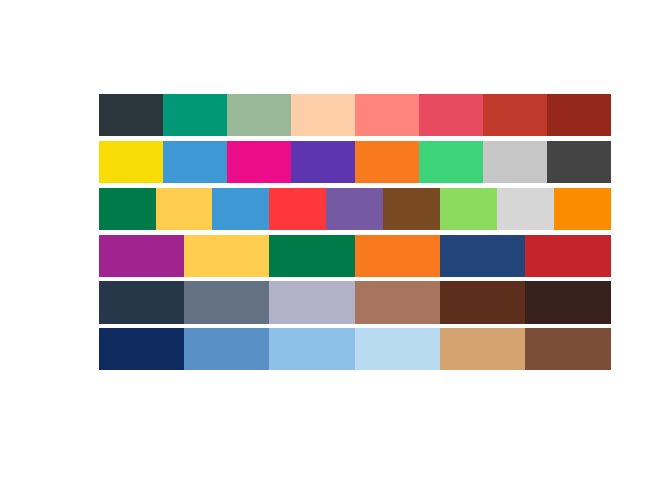

# Color palette

## :hammer: Install pak

``` r
install.packages("paletteer")
install.packages("pals")
```

## Calling colors

``` r
library(paletteer)
library(tidyr)
library(pals)
load("sysdata.rda") #download from this Git rep

color_filter <- function(names = d_names, min = 15, max = 50){ 
    
    leng_ma <- lapply(names, function(i) {
        length(paletteer_d(i))
    }) %>% do.call(rbind, .)
    
    len_df <- as.data.frame(leng_ma) 
    len_df$paletteer <- d_names 
    paletterr_d_15 <- len_df[len_df[1] > min & len_df[1] < max,]
    
    color_15 <- lapply(paletterr_d_15$paletteer, function(i) paletteer_d(i) ) 
    names(color_15) <- paletterr_d_15$paletteer 
    return(color_15)
}
```

## Get col

``` r
color_5 <- color_filter(min = 5, max = 10) #min:Minimum color number; max: Maximum color number
do.call(pal.bands, color_5 %>% head)
```

<!-- -->

``` r
head(color_5)
```

    ## $`awtools::a_palette`
    ## <colors>
    ## #2A363BFF #019875FF #99B898FF #FECEA8FF #FF847CFF #E84A5FFF #C0392BFF #96281BFF 
    ## 
    ## $`awtools::ppalette`
    ## <colors>
    ## #F7DC05FF #3D98D3FF #EC0B88FF #5E35B1FF #F9791EFF #3DD378FF #C6C6C6FF #444444FF 
    ## 
    ## $`awtools::mpalette`
    ## <colors>
    ## #017A4AFF #FFCE4EFF #3D98D3FF #FF363CFF #7559A2FF #794924FF #8CDB5EFF #D6D6D6FF #FB8C00FF 
    ## 
    ## $`awtools::spalette`
    ## <colors>
    ## #9F248FFF #FFCE4EFF #017A4AFF #F9791EFF #244579FF #C6242DFF 
    ## 
    ## $`beyonce::X1`
    ## <colors>
    ## #273649FF #647184FF #B1B2C8FF #A7755DFF #5D2E1CFF #38201CFF 
    ## 
    ## $`beyonce::X2`
    ## <colors>
    ## #0F2B5FFF #5991C7FF #8EC1E7FF #B9DBF1FF #D5A370FF #7B4F37FF
